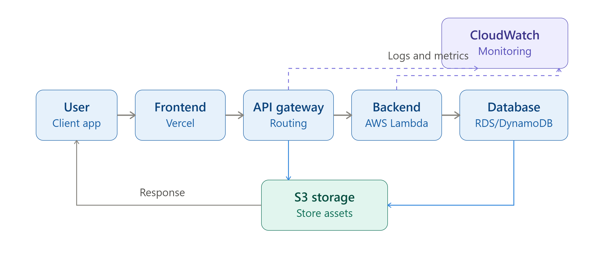

# Architecture Notes 

## 1. Frontend
- User accesses website via browser
- Hosted on Vercel / AWS Amplify

## 2. Backend 
- API Gateway + AWS Lambda handles logic

## 3. Database 
- AWS RDS / DynamoDB for storage

## 4. FLow
user -> Frontend -> AOI Gateway -> Backend -> Database -> Response to User

## 5. Security & Monitoring 
-HTTPS, Authentication 
-CloudWatch for logs and Monitoring 

# SWYNEX - Cloud Architecture Document

**GitHub URL:** https://github.com/priyankabaderia8/SWYNEX-Cloud-Architecture

## 1. Compute (Processing Power)
The compute layer handles all the business logic.

*   **Frontend Compute - Vercel:** We use Vercel for hosting our React/Next.js frontend. It provides Edge Computing, meaning the site loads fast from anywhere. It is serverless, so we don't manage any server.
*   **Backend Compute - AWS Lambda:** We use AWS Lambda for backend. It is Function-as-a-Service (FaaS). When user calls an API, Lambda runs the code and then shuts down. We pay only for the time it runs. It is highly scalable.

## 2. Storage (Data Saving)
We use two types of storage.

*   **Object Storage - AWS S3:** For storing static assets like user profile images, documents, and frontend build files. S3 is 99.99% durable and cheap.
*   **Database Storage - DynamoDB / RDS:** For structured data.
    *   DynamoDB (NoSQL) for fast user sessions and login data.
    *   RDS (SQL) if we need relational data like transactions.

## 3. Networking (How Data Moves)
Networking connects all services securely.

*   **API Gateway:** It is the single entry point for all backend requests. It handles Routing (`/login`, `/users`), Rate Limiting, and CORS. Frontend never calls Lambda directly.
*   **HTTPS & Vercel Edge Network:** All traffic is encrypted via HTTPS.
*   **Response Flow:** User (Client App) -> Frontend (Vercel) -> API Gateway (Routing) -> Backend (Lambda) -> Database -> S3 -> Response back to User.

## 4. Identity & Security (Who Can Access)
This is the most important part for security.

*   **AWS IAM (Identity and Access Management):** We create IAM Roles. Example: Lambda Role can only read DynamoDB and write to S3. It cannot delete anything. This is called Least Privilege Principle.
*   **Authentication - AWS Cognito / JWT:** When user logs in, Cognito verifies and gives a JWT Token. Every API call checks this token.
*   **CloudWatch Monitoring:** CloudWatch logs every access. If someone tries unauthorized access, we get logs and metrics in CloudWatch Monitoring.

## Summary Diagram

